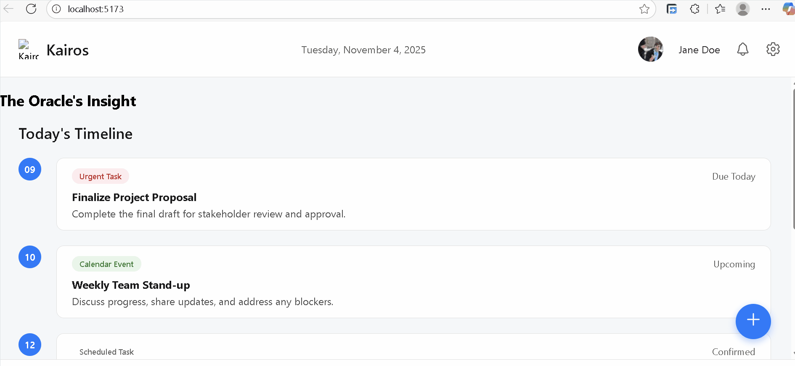

# Kairos - Time Management App
## Project Repository link: https://github.com/Kairos-Moment/kairos-app

CodePath WEB103 Final Project

Designed and developed by: Judah Bowers, Jorge Valdes-Santiago, Kevin Jerome

🔗 Link to deployed app:

## About

### Description and Purpose

Kairos is an intelligent time management and productivity application designed to help users move beyond simple to-do lists. It acts as a proactive digital partner, helping users not only manage their tasks but also understand their own productivity patterns. By integrating smart scheduling, goal tracking, and focus tools, Kairos helps users conquer their day with intention, clarity, and a better work-life balance.

The primary purpose of Kairos is to empower individuals to transition from a reactive to a proactive approach to their time. In a world of constant digital distractions and overwhelming schedules, people often feel controlled by their time rather than in control of it. Kairos aims to solve this by providing a holistic system that clarifies priorities, reduces decision fatigue, and builds sustainable, productive habits, ultimately decreasing stress and increasing personal fulfillment.

### Inspiration

The name and core philosophy are inspired by the ancient Greek concept of Kairos. While Chronos refers to chronological, sequential time (the minutes and hours that pass), Kairos signifies the opportune moment—the right, critical, or supreme moment to act.
Our app is built on the idea that effective time management isn't just about scheduling every minute (Chronos); it's about identifying and capitalizing on the perfect moments for specific types of work, rest, and growth (Kairos). The app is designed to help users find their personal "Kairos" moments throughout the day.

## Tech Stack

Frontend: React.js

Backend: Node.js, Express.js

Database & Deployment: Render

## Features

### Dynamic Timeline ✅

A visual, intelligent calendar that goes beyond a simple schedule. Users input their tasks, appointments, and energy levels, and the Kairos algorithm suggests an optimal, fluid schedule for the day. It can automatically reschedule non-critical tasks if an unexpected meeting arises.

### Priority Matrix ✅

An integrated feature based on the Eisenhower Matrix. When adding a task, users can quickly classify it as:
- Urgent & Important (Do Now)
- Not Urgent & Important (Schedule for Later)
- Urgent & Not Important (Delegate)
- Not Urgent & Not Important (Eliminate)
- This immediately clarifies daily priorities.

### Focus Mode

A customizable, distraction-free timer. Users can start a "Focus Session" for a specific task. During this time, app notifications can be silenced, and the screen displays only the task at hand, a timer, and motivational quotes. It can also integrate with ambient soundscapes.

[gif goes here]

### Goal & Milestone Tracking

Users can define long-term goals (e.g., "Complete Capstone Project," "Run a 5K"). They can then break these goals into smaller, actionable milestones and link daily tasks directly to them. This visually connects small efforts to the bigger picture, boosting motivation.

[gif goes here]

### The Oracle - AI-Powered Insights:

A smart assistant that learns user habits over time. The Oracle provides:
- Weekly Productivity Reports: Showing where time was spent, peak focus hours, and task completion rates.
- Proactive Suggestions: "You're usually most creative in the morning. I suggest working on your 'Design Mockup' task then."
- Burnout Warnings: "You've scheduled 10 hours of high-intensity tasks back-to-back. Consider adding a break."

[gif goes here]

### Habit Weaver

A dedicated section for building and tracking recurring habits. Users can set daily, weekly, or monthly habits (e.g., "Read for 30 mins," "Weekly review"). The app uses streaks and gentle reminders to help weave these positive actions into the user's daily fabric.

[gif goes here]

## Installation Instructions

[instructions go here]
